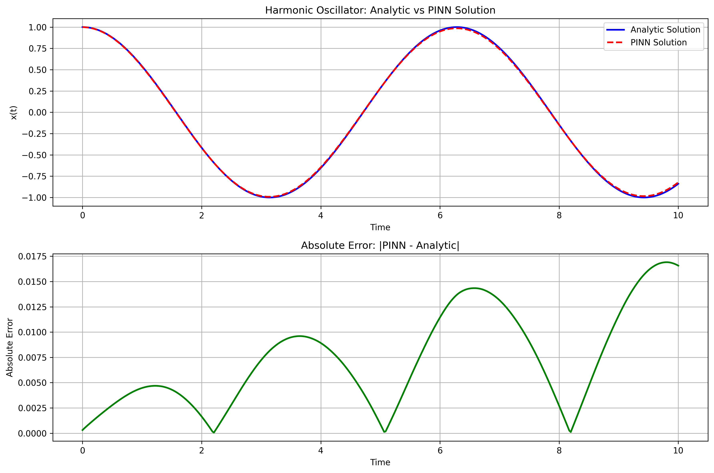

# Solving the 1D Harmonic Oscillator with PINN-kit

This tutorial demonstrates how to solve the 1D harmonic oscillator equation using a Physics-Informed Neural Network (PINN) with the [PINN-kit](https://github.com/shivani/PINN-kit) library. We will walk through the code, explain each step, and interpret the results.

---

## Problem Statement

We aim to solve the following 1D harmonic oscillator equation:

$$
\frac{d^2x}{dt^2} + \omega^2 x = 0, \quad t \in [0, 10]
$$

with initial conditions:

$$
x(0) = 1, \quad \frac{dx}{dt}(0) = 0$$

where $\omega = 1.0$ is the angular frequency.

The analytical solution is:

$$
x(t) = \cos(\omega t)$$

---

## 1. Setup and Requirements

- Python 3.12+
- torch
- numpy
- matplotlib
- pinn-kit

Install dependencies (if not already):

```bash
pip install pinn-kit matplotlib
```

---

## 2. Code Walkthrough

### a. Imports and Device Setup

```python
import numpy as np
import torch
import torch.nn as nn
from torch.autograd import Variable
import json
import matplotlib.pyplot as plt
from pinn_kit.Domain import Domain
from pinn_kit.PINN import PINN

device = (
    "cuda" if torch.cuda.is_available() else "mps" if torch.backends.mps.is_available() else "cpu"
)
print(f"Using {device} device")
```

### b. Define the PDE Residual and Loss Functions

```python
# Parameters for harmonic oscillator
omega = 1.0  # Angular frequency
T_MIN = 0.0
T_MAX = 10.0  # Time range to solve over

def compute_residual(input_tensors, x):
    """
    Compute the residual for the 1D harmonic oscillator equation:
    d²x/dt² + ω²x = 0
    """
    t = input_tensors[0]
    
    # First derivative
    x_t = torch.autograd.grad(x, t, grad_outputs=torch.ones_like(x), create_graph=True)[0]
    
    # Second derivative
    x_tt = torch.autograd.grad(x_t, t, grad_outputs=torch.ones_like(x_t), create_graph=True)[0]
    
    # Residual computation (harmonic oscillator equation)
    residual = x_tt + (omega**2) * x
    
    return residual

def residual_loss(input_tensors, net_output):
    """
    Compute the residual loss
    """
    pred_residual_values = compute_residual(input_tensors, net_output)
    true_residual_values = Variable(torch.zeros_like(pred_residual_values).float(), requires_grad=False).to(device)
    return torch.nn.MSELoss()(pred_residual_values, true_residual_values)

def initial_condition_loss(input_tensors, net_output):
    """
    Compute the initial condition loss: x(0) = 1
    """
    t = input_tensors[0]
    # Initial conditions: x(0) = 1, x'(0) = 0
    initial_indices = torch.nonzero(t[:, 0] == T_MIN)
    if initial_indices.shape[0] != 0:
        pred_initial_values = net_output[initial_indices]
        true_initial_values = Variable(torch.ones_like(pred_initial_values).float(), requires_grad=False).to(device)
        return torch.nn.MSELoss()(pred_initial_values, true_initial_values)
    return 0

def initial_velocity_loss(input_tensors, net_output):
    """
    Compute the initial velocity loss: x'(0) = 0
    """
    t = input_tensors[0]
    initial_indices = torch.nonzero(t[:, 0] == T_MIN)
    if initial_indices.shape[0] != 0:
        # Get the initial time points
        t_initial = t[initial_indices]
        # Get the network output at initial time points
        x_initial = net_output[initial_indices]
        # Compute the derivative at initial time points
        x_t = torch.autograd.grad(x_initial, t_initial, 
                                grad_outputs=torch.ones_like(x_initial), 
                                create_graph=True, 
                                allow_unused=True)[0]
        if x_t is None:
            return torch.tensor(0.0, device=device)
        true_velocity = Variable(torch.zeros_like(x_t).float(), requires_grad=False).to(device)
        return torch.nn.MSELoss()(x_t, true_velocity)
    return torch.tensor(0.0, device=device)
```

### c. Hyperparameters and Domain

```python
NUM_LAYERS = 8
NUM_NEURONS_IN_EACH_LAYER = 40
NUM_SAMPLES = 400
PATH = 'harmonic_oscillator_pinn_kit_results'
OPTIMISER = 'adam'
NUM_EPOCHS = 30000

LR_SCHEDULER = True
LR_SCHEDULER_PATIENCE = NUM_EPOCHS/20
LR_SCHEDULER_FACTOR = 0.5

# Create domain using pinn-kit's flexible interface
domain = Domain([("t", T_MIN, T_MAX)])

# Sample points using uniform distribution
print("Sampling points using uniform distribution...")
t_arr = np.linspace(T_MIN, T_MAX, NUM_SAMPLES).reshape(NUM_SAMPLES, 1)

print(f"Number of Points: {t_arr.shape[0]}")
```

### d. Build and Train the PINN

```python
layer_list = [1] + [NUM_NEURONS_IN_EACH_LAYER] * NUM_LAYERS + [1]
network = PINN(
    layer_list,
    activation_function_name="tanh",
    initialisation_function_name=None
).to(device)

print(f"Network architecture: {layer_list}")
print(f"Total parameters: {sum(p.numel() for p in network.parameters())}")

# Configure training
network.set_path(PATH)
network.configure_optimiser(OPTIMISER, initial_lr=0.002)

if LR_SCHEDULER:
    network.configure_lr_scheduler("reduce_lr_on_plateau", factor=LR_SCHEDULER_FACTOR, patience=LR_SCHEDULER_PATIENCE)
else:
    network.configure_lr_scheduler()

# Define loss functions
loss_list = [
    {"function": residual_loss, "indices": None, "weight": 1},
    {"function": initial_condition_loss, "indices": None, "weight": 10},
    {"function": initial_velocity_loss, "indices": None, "weight": 10}
]

print("Starting training...")
print(f"Training for {NUM_EPOCHS} epochs with {NUM_SAMPLES} points")

training_history = network.train_model(
    [t_arr], 
    loss_list, 
    NUM_EPOCHS, 
    NUM_SAMPLES,  # Use all points as batch size
    monitoring_function=None
)
```

---

## 3. Results and Visualization

After training, we compare the PINN solution to the analytical solution and plot the results.

```python
# Save training history and analytic solution
np.save(PATH + '_training_history.npy', training_history)
analytic_solution = np.cos(omega * t_arr)
np.save(PATH + '_analytic_solution.npy', analytic_solution)

# Plot training history
plt.figure(figsize=(10, 6))
plt.plot(training_history)
plt.title('Training History')
plt.xlabel('Epoch')
plt.ylabel('Loss')
plt.yscale('log')
plt.grid(True)
plt.savefig(PATH + '_training_history.png', dpi=300, bbox_inches='tight')
plt.show()

# Plot comparison with analytic solution
with torch.no_grad():
    network.eval()
    t_tensor = torch.tensor(t_arr, dtype=torch.float32).to(device)
    predicted_solution = network([t_tensor]).cpu().numpy()

plt.figure(figsize=(12, 8))

# Plot solutions
plt.subplot(2, 1, 1)
plt.plot(t_arr, analytic_solution, 'b-', linewidth=2, label='Analytic Solution')
plt.plot(t_arr, predicted_solution, 'r--', linewidth=2, label='PINN Solution')
plt.xlabel('Time')
plt.ylabel('x(t)')
plt.title('Harmonic Oscillator: Analytic vs PINN Solution')
plt.legend()
plt.grid(True)

# Plot error
plt.subplot(2, 1, 2)
error = np.abs(predicted_solution - analytic_solution)
plt.plot(t_arr, error, 'g-', linewidth=2)
plt.xlabel('Time')
plt.ylabel('Absolute Error')
plt.title('Absolute Error: |PINN - Analytic|')
plt.grid(True)

plt.tight_layout()
plt.savefig(PATH + '_comparison.png', dpi=300, bbox_inches='tight')
plt.show()
```

### Example Output



- **Top:** PINN vs Analytical Solution showing the oscillatory behavior
- **Bottom:** Absolute Error between PINN and analytical solution

The PINN should accurately capture the cosine oscillation with minimal error.

---

## 4. Key Features of This Implementation

### Physics-Informed Loss Functions
- **Residual Loss**: Enforces the harmonic oscillator differential equation
- **Initial Condition Loss**: Ensures x(0) = 1
- **Initial Velocity Loss**: Ensures x'(0) = 0

### Network Architecture
- 8 hidden layers with 40 neurons each
- Tanh activation function
- Xavier normal initialization

### Training Strategy
- Adam optimizer with learning rate 0.002
- Learning rate scheduler with patience and factor reduction
- 30,000 epochs for convergence
- 400 uniformly distributed training points

---

## 5. Summary and Next Steps

- The PINN successfully solves the 1D harmonic oscillator equation, matching the analytical cosine solution.
- The implementation demonstrates handling of initial conditions and their derivatives.
- Error analysis shows the accuracy of the physics-informed approach.

**Try extending this example to:**
- Different angular frequencies (ω)
- Damped harmonic oscillators
- Forced harmonic oscillators
- Higher-dimensional oscillators

---

For more details, see the [PINN-kit documentation](https://github.com/shivani/PINN-kit). 