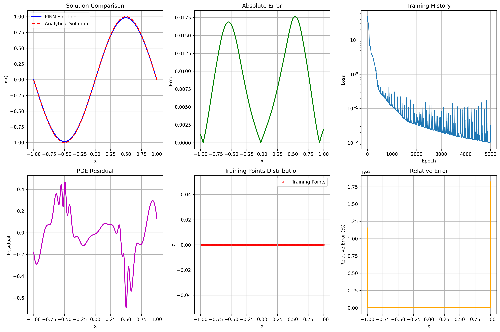

# Solving the 1D Poisson Equation with PINN-kit

This tutorial demonstrates how to solve the 1D Poisson equation using a Physics-Informed Neural Network (PINN) with the [PINN-kit](https://github.com/shivani/PINN-kit) library. We will walk through the code, explain each step, and interpret the results.

---

## Problem Statement

We aim to solve the following 1D Poisson equation:

$$
-\frac{d^2u}{dx^2} = \pi^2 \sin(\pi x), \quad x \in [-1, 1]
$$

with boundary conditions:

$$
u(-1) = 0, \quad u(1) = 0$$

The analytical solution is:

$$
u(x) = \sin(\pi x)$$

---

## 1. Setup and Requirements

- Python 3.12+
- torch
- numpy
- matplotlib
- pinn-kit

Install dependencies (if not already):

```bash
pip install pinn-kit matplotlib
```

---

## 2. Code Walkthrough

### a. Imports and Device Setup

```python
import numpy as np
import torch
import torch.nn as nn
from torch.autograd import Variable
import json
import matplotlib.pyplot as plt
from pinn_kit.Domain import Domain, convert_to_meshgrid
from pinn_kit.PINN import PINN

device = (
    "cuda" if torch.cuda.is_available() else "mps" if torch.backends.mps.is_available() else "cpu"
)
print(f"Using {device} device")
```

### b. Define the PDE Residual and Loss Functions

```python
def compute_residual(input_tensors, u):
    x = input_tensors[0]
    u_x = torch.autograd.grad(u.sum(), x, create_graph=True)[0]
    u_xx = torch.autograd.grad(u_x.sum(), x, create_graph=True)[0]
    residual = -u_xx - (np.pi**2) * torch.sin(np.pi * x)
    return residual

def find_boundary_indices(input_tensors):
    x = input_tensors[0]
    boundary_indices = torch.nonzero(torch.abs(x[:, 0] - domain.variables[0][1]) < 1e-6)
    boundary_indices = torch.cat((boundary_indices, torch.nonzero(torch.abs(x[:, 0] - domain.variables[0][2]) < 1e-6)))
    boundary_indices = boundary_indices.unique()
    return boundary_indices

def residual_loss(input_tensors, net_output):
    pred_residual_values = compute_residual(input_tensors, net_output)
    true_residual_values = Variable(torch.zeros_like(pred_residual_values).float(), requires_grad=False).to(device)
    return torch.nn.MSELoss()(pred_residual_values, true_residual_values)

def boundary_loss(input_tensors, net_output, boundary_indices):
    if boundary_indices.shape[0] != 0:
        pred_boundary_values = net_output[boundary_indices]
        true_boundary_values = Variable(torch.zeros_like(pred_boundary_values).float(), requires_grad=False).to(device)
        return torch.nn.MSELoss()(pred_boundary_values, true_boundary_values)
    else:
        return 0
```

### c. Hyperparameters and Domain

```python
NUM_LAYERS = 6
NUM_NEURONS_IN_EACH_LAYER = 20
X_MIN, X_MAX = -1.0, 1.0
NUM_SAMPLES = 200
PATH = 'poisson_equation_results'
OPTIMISER = 'adam'
NUM_EPOCHS = 5000

# Save hyperparameters for reproducibility
model_hyperparameters = {...}
with open(PATH + ".json", 'w') as json_file:
    json.dump(model_hyperparameters, json_file, indent=2)

domain = Domain([("x", X_MIN, X_MAX)])
x_arr = domain.sample_points(NUM_SAMPLES, sampler=None)[0]
```

### d. Build and Train the PINN

```python
layer_list = [1] + [NUM_NEURONS_IN_EACH_LAYER] * NUM_LAYERS + [1]
network = PINN(
    layer_list, 
    activation_function_name="tanh",
    initialisation_function_name="xavier_normal"
).to(device)
network.configure_optimiser(OPTIMISER, initial_lr=0.001)
network.set_path(PATH)
network.configure_lr_scheduler()

loss_list = [
    {"function": residual_loss, "indices": None, "weight": 1},
    {"function": boundary_loss, "indices": find_boundary_indices, "weight": 10}
]

training_history = network.train_model(
    input_arrays=[x_arr],
    loss_list=loss_list,
    num_epochs=NUM_EPOCHS,
    batch_size=1000,
    monitoring_function=None
)
```

---

## 3. Results and Visualization

After training, we compare the PINN solution to the analytical solution, plot the error, residual, training points, and training history.

```python
x_test = np.linspace(X_MIN, X_MAX, 1000).reshape(-1, 1)
x_test_tensor = torch.tensor(x_test, dtype=torch.float32).to(device)
with torch.no_grad():
    u_pred = network([x_test_tensor]).cpu().numpy()
u_analytical = np.sin(np.pi * x_test)
error = np.abs(u_pred - u_analytical)
relative_error = np.abs(error / (np.abs(u_analytical) + 1e-10)) * 100
```

### Example Output



- **Top Left:** PINN vs Analytical Solution
- **Top Middle:** Absolute Error
- **Top Right:** Training Loss History (log scale)
- **Bottom Left:** PDE Residual
- **Bottom Middle:** Training Points Distribution
- **Bottom Right:** Relative Error (%)

---

## 4. Summary and Next Steps

- The PINN accurately solves the 1D Poisson equation, matching the analytical solution.
- Error and residual plots help diagnose model performance.
- You can experiment with different architectures, sampling strategies, or PDEs using PINN-kit.

**Try extending this example to higher dimensions or other equations!**

---

For more details, see the [PINN-kit documentation](https://github.com/shivani/PINN-kit). 